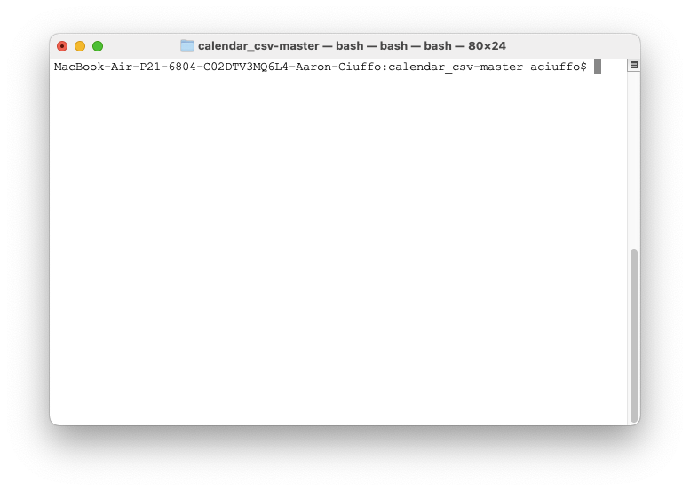
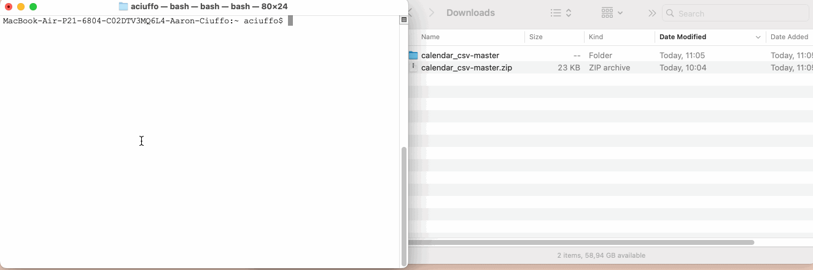

# Google Calendar CSV Generator

Python script for generating files suitable for import into Google Calendar based on `.csv` schedule files for N-day rotating block schedules. This script will produce one CSV for each unique event as well as a CSV for each day in the block rotation.

If your schedule has "Block A, Block B, Block C, Lunch, Break 1, Break 2" seven CSV files will be produced, one for each event in the rotation: e.g. Block A, Block B, Block C, lunch, breaks. Each file produced will contain all of the calendar events for all days that match that event.

## Table of Contents

- [Google Calendar CSV Generator](#google-calendar-csv-generator)
  - [Table of Contents](#table-of-contents)
  - [Common Patterns \& Use Case](#common-patterns--use-case)
  - [Getting Started](#getting-started)
    - [Novice Instructions](#novice-instructions)
  - [Use](#use)
    - [Creating a CSV file](#creating-a-csv-file)
    - [Generate Calendar CSV Files](#generate-calendar-csv-files)
  - [Command Reference](#command-reference)

## Common Patterns & Use Case

Our school uses an 6-Day (Elementary School) and 8-Day (Middle/High School) rotation schedule with an alternate, shortened time-table that is used on a Wednesdays. Our instructional days are Monday-Friday.

The rotation schedule begins with a "Day 1" on the first day of school and continues N school-days before starting again. On Wednesdays we have an early dismissal that uses an "alternate" time-table with shorter blocks.

| Day 1 | Day 2 | Day 3 | Day 4 | Day 5 | Day 6 | Day 7 | Day 8 | Day 1 |
|:-:|:-:|:-:|:-:|:-:|:-:|:-:|:-:|:-:|
| Weds: 21/08/17 | Thurs: 21/08/18 | Fri: 21/08/19 | Mon: 21/08/23 | Tues: 21/08/24 | Weds: 21/08/25 | Thurs: 21/08/26 | Fri: 21/08/27 | Mon: 21/08/30 |
| Alternate Sch. | Standard Sch. | Standard Sch. | Standard Sch. | Standard Sch. | Alternate Sch. | Standard Sch. | Standard Sch. | Standard Sch. |

Our highschool has 8 instructional blocks (A..H), two breaks, a "Flex" block and Lunch. This script produces 14 calendar CSV files. Teachers can then import just the blocks that are relevant to their work (e.g. [A, B, D, F, H, Break 2, Flex] ). The Rotation_Day.csv includes "all day" events that indicate the rotation day as well as the N/Total school day.

## Getting Started

### Novice Instructions

1. [Download this Zip File](https://github.com/txoof/calendar_csv/archive/refs/heads/master.zip)
2. Unpack the zip file by double clicking on it in *Finder*
3. Create (or update) the following files. It is easiest if the file names do **not** have any spaces.
   - `bell_schedule.csv` - This file contains the bell schedule timing for each block (an example file is provided)
   - `non_instruction.txt` - This file contains the dates in YYYY/MM/DD format that are considered "non instructional" such as conference days or PD days. 
4. Run the *Terminal.app* application (found in the applications folder)

1. Type `cd` followed by a space in the terminal window
2. Click on the unzipped folder in Finder and drag it into the terminal window. Then press `Enter` (`⏎` key).
   - This will add "path" the program so you don't need to type it

1. Paste the following command into the terminal window and press enter. **NOTE:** you may need to change the file names and dates to match your files and dates before pressing `Enter` (`⏎` key).
   - `gcal_csv_generator.py  --schedule_file ./school_schedule_file.csv
   --start "2022/08/17" --end "2023/06/16" --non_instruction ./non_instruction.txt --alternate_day Wednesday`
8. CSV files will appear on your desktop in a folder

## Use

You will need the following:

* Schedule file in [`.csv` format](./hs_sample.csv)
  * Blank lines are ignored
* Non-instructional days file 
  * [Flat file with one day per line in YYYY/MM/DD format](./non_instruction_sample.txt)
  * Days that the rotation should "skip" such as holidays, parent-teacher conferences, PD Days, etc. Weekend days (Saturday & Sunday) are automatically skipped
* First and Last date of the instructional term
  * `YYYY/MM/DD` format: `2022/08/29`

### Creating a CSV file

To create a CSV file, use the sample [CSV template](./sample.csv) provided.

See the [HS Sample](./hs_sample.csv) for a 8-Block rotation over 8 days with an alternate shortened schedule. The [ES Sample](./es_sample.csv) shows a 6 day rotation with no alternate wednesday schedule.

**Required Columns:**

* **`day`** Unique title of day in rotation (e.g. Day 1, Blue, Alpha, etc.)
* **`subject`** Title of subject/block name (e.g. Block A, 3A Music, Lunch, etc.)
* **`start`** Start time in HH:MM format (e.g. 13:55, 08:30)
* **`end`** End time in HH:MM format
* **`alternate`** this is an "alternate" schedule as boolean: (True/False/\<blank\>)
* All other columns will be ignored

### Generate Calendar CSV Files

Example

```bash
gcal_csv_generator.py  --schedule_file ./school_schedule_file.csv \
--start "2022/08/17" --end "2023/06/16" --non_instruction ./non_instruction.txt \
--alternate_day Wednesday
```

## Command Reference

`--schedule_file/-c`:
.csv formatted schedule file (required)

`--start/-s`:
First day of school in YYYY/MM/DD format (required)

`--end/-e`:
Last day of school in YYYY/MM.DD format (required)

`--non-instruction/-n`:
flat file with one non-instructional day per line (required)

`--date_format`:
Format of dates; the default is in YYYY/MM/DD format. See the [Python datetime documentation](https://docs.python.org/3/library/datetime.html#strftime-and-strptime-behavior) for alternative formats. (optional)

`--alternate_day`
Single day of the week to use an alternative day schedule (e.g. Wednesday, Tuesday). (optional)

`--output/-o`
Location for schedule file output. Default is ~/Desktop